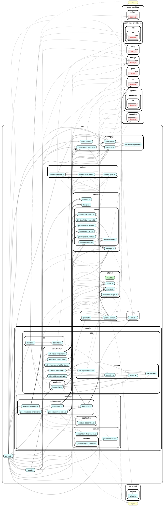

# Module-boundary audit (Milestone 17)

A checkpoint, not a feature — this is the gate before Milestone 18 cuts
`execution` into its own deployable service. If a "convenience" direct
cross-module call had crept in anywhere, this is where it gets caught
while it's still a cheap refactor instead of a rewrite.

## Mechanical check

`.dependency-cruiser.cjs`'s `no-cross-module-internals` and
`shared-must-not-depend-on-modules` rules were already at
`severity: 'error'` (set at Milestone 1, unchanged since) — CI already
fails the build on a violation via `npm run boundaries`. Re-run for this
milestone:

```
$ npm run boundaries
✔ no dependency violations found (60 modules, 195 dependencies cruised)
```

`scripts/check-boundaries.sh` wraps this same check plus regenerates the
dependency graph below, so both the enforcement and the visualization
stay in sync going forward.

## Manual grep audit

Belt-and-suspenders check for any direct import of another module's
`application`/`domain`/`infrastructure` layer, bypassing its `api/`:

```
$ grep -rn "from '.*modules/jobs" src/modules/execution/
(none found)
$ grep -rn "from '.*modules/execution" src/modules/jobs/
(none found)
$ grep -rnE "from '@/modules/[a-z]+/(application|domain|infrastructure)" src/modules/
(no matches)
```

Every cross-module interaction in the codebase is either a Kafka event
(via `src/contracts`/`src/messaging`) or a call into `server.ts` — the
composition root, which is allowed to reach across modules since it's
where dependency wiring happens, not business logic.

## Dependency graph



Rendered via `scripts/render-dependency-graph.mjs`
(`@hpcc-js/wasm-graphviz` — no system Graphviz install required) from
`dependency-cruiser`'s own `--output-type dot` output. Regenerate with
`./scripts/check-boundaries.sh` any time the module graph changes.

`jobs/` and `execution/` render as two separate clusters with no edges
directly between their `domain`/`application`/`infrastructure`
subgraphs — the only paths between them run through the shared
`contracts`/`messaging` clusters above, or fan out from `server.ts` at
the bottom (the composition root).

## Result

Green light to proceed to [Milestone 18](./roadmap.html#m18).
